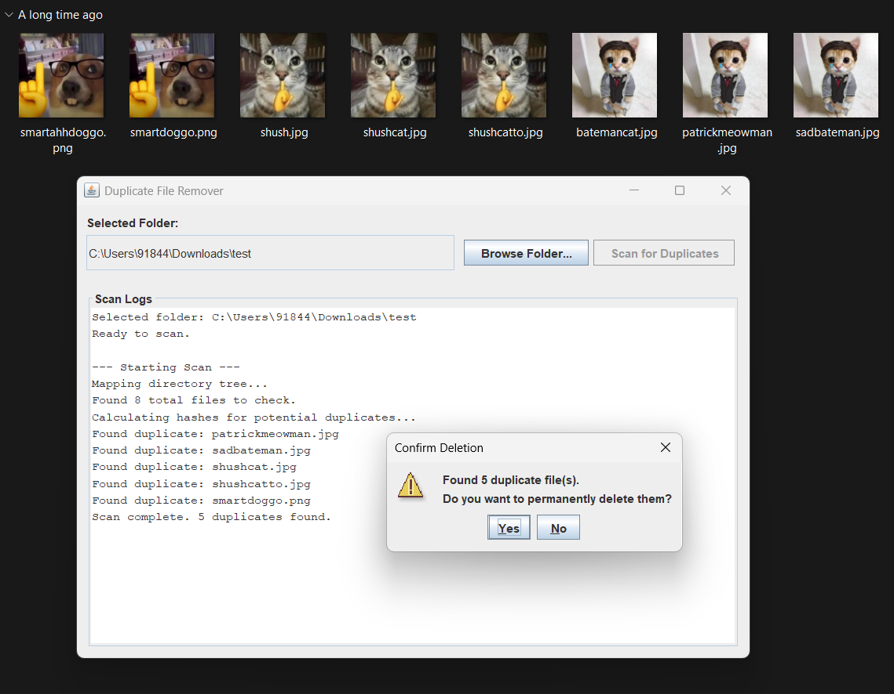
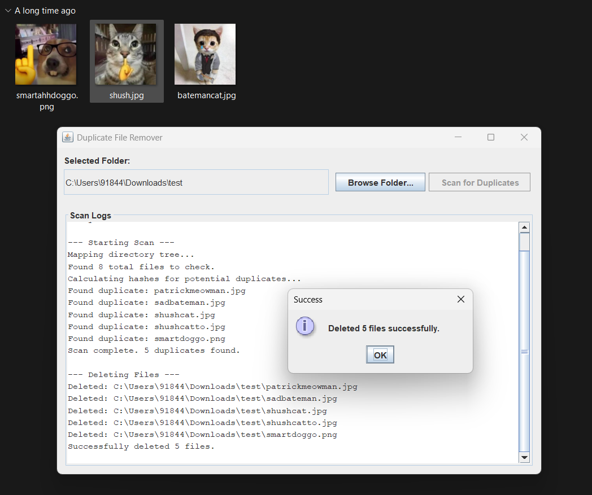

# Duplicate File Remover (Java GUI)

A lightweight, high-performance graphical desktop application built in Java that safely scans directories to find and permanently remove duplicate files, freeing up valuable disk space. 

### Features
* **Interactive GUI:** Easy-to-use window with folder browsing and real-time scanning logs.
* **Deep Recursive Scanning:** Digs through the selected folder and all of its nested subfolders.
* **Optimized Performance:** Pre-filters files by exact byte size before executing heavy MD5 hash computations, drastically speeding up scan times.
* **Safe Deletion:** Displays a comprehensive list of found duplicates and requires explicit user confirmation via a pop-up dialog before any files are permanently deleted.
* **Zero Dependencies:** Built entirely using native Java libraries (Swing, IO, Security).

---

## ⚙️ Environment Setup & Prerequisites

Because this project uses native Java libraries, there is no need for complex package managers like Maven or Gradle. However, you must have the Java Development Kit (JDK) installed.

1. **Install Java (JDK 8 or higher):**
   * Download and install the JDK from the [Oracle Website](https://www.oracle.com/java/technologies/downloads/) or use an open-source alternative like [Adoptium](https://adoptium.net/).
2. **Verify Installation:**
   * Open your terminal or command prompt and run the following commands to ensure Java is added to your system's PATH:
     ```bash
     java -version
     javac -version
     ```
   * *Note: Both commands should return a version number. If they are not recognized, you will need to add Java to your OS Environment Variables.*

## 📦 Dependency Installation & Configuration

**No external dependencies are required.** This application relies exclusively on built-in Java packages:
* `java.io` (File handling and streams)
* `java.security` (MD5 hashing)
* `javax.swing` & `java.awt` (Graphical User Interface)

**Configuration:**
There are no configuration files to edit. The application dynamically adjusts to the folder path provided by the user at runtime.

---

## 🚀 How to Run and Execute the Project

Follow these exact steps to compile and run the application from your terminal:

**Step 1: Download the Source Code**
Save the main application file as `DuplicateFileRemover.java` in a dedicated folder on your computer.

**Step 2: Open Terminal/Command Prompt**
Navigate to the directory where you saved the file.
```bash
cd path/to/your/folder
```
**Step 3: Compile the Java file by running:**
```bash
javac DuplicateFileRemover.java
```

**Step 4: Run the application by executing:**
```bash
java DuplicateFileRemover
```

## 📸 Screenshots

**Before:**


**After:**


## 🧠 Working (How It Works Under the Hood)

This application uses a multi-tiered filtering approach to maximize efficiency and safely manage memory:

* **Recursive Directory Mapping:** Using a recursive helper method and Java's `File.listFiles()`, the application builds an exhaustive list of every single file located inside the target directory and its subdirectories.
* **First Pass (Size Filtering):** It groups all discovered files by their exact size in bytes using `file.length()`. If a file has a completely unique size, it cannot possibly be a duplicate and is immediately discarded from the search. This saves massive amounts of processing time.
* **Second Pass (MD5 Hashing):** For files that share the exact same byte size, the application reads them in 64KB memory blocks using `FileInputStream` and calculates their MD5 cryptographic checksum via Java's `MessageDigest`. Reading in blocks ensures the application does not crash when processing massive files (like 4GB video files).
* **Validation & Execution:** If multiple files produce the exact same MD5 hash, they are flagged as duplicates. The GUI then pauses the background thread and presents a `JOptionPane` confirmation dialog. If the user clicks "Yes", the duplicates are permanently deleted using Java's `.delete()` method.

## 👤 Author Name

**Aryan Sharma 🦕**
